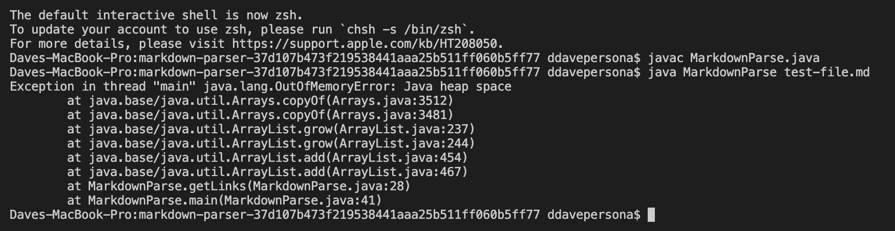
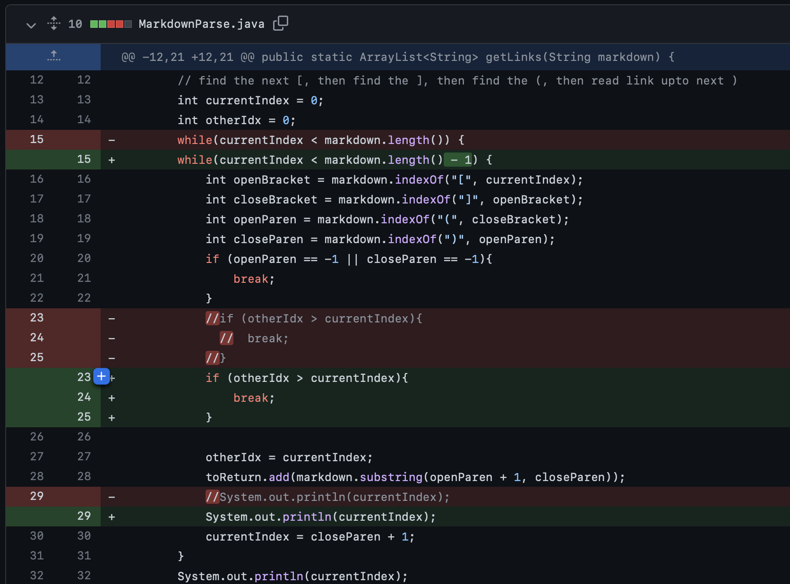
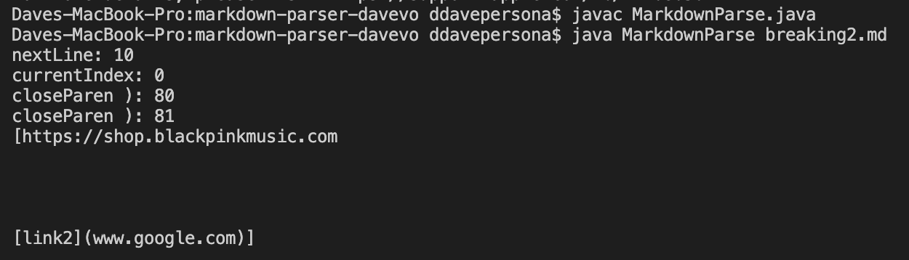
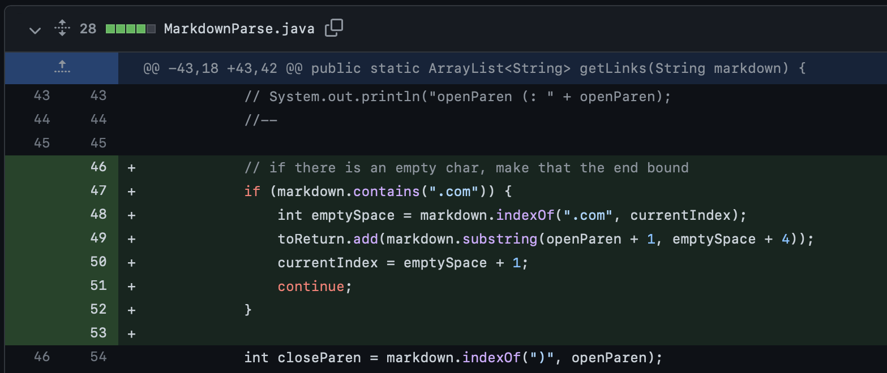
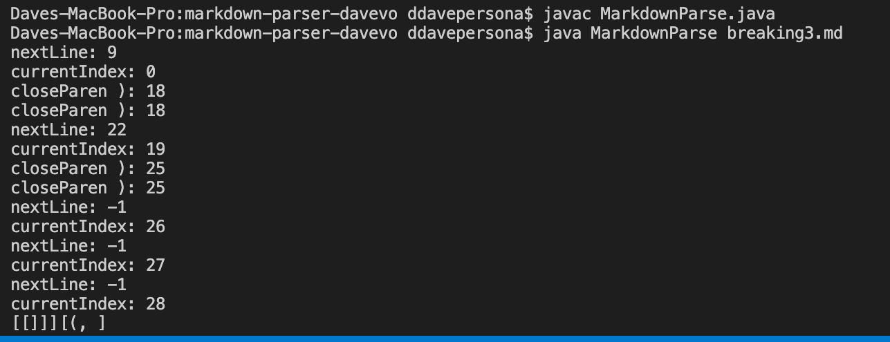
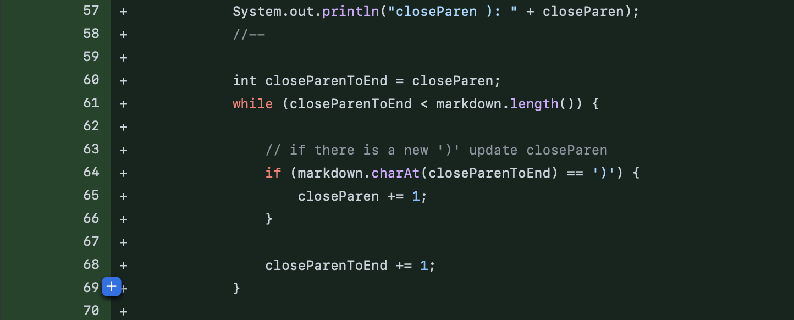

# **Lab 3 / Lab 4: Markdown Parsing**

`by Dave Vo | 4/24/22`

## 1. Handling Empty Lines
#

[test-file.md](https://github.com/Tyler-Culp/markdown-parser/commit/bef0fc4375834afad51ec981ee6b504dc696669d) is the failure-inducing input used to test the case when empty lines are in the markdown file.

When the file is ran with the original code, an `OutOfMemory` error occurs.

To prevent the program from crashing, the program keeps track of a secondary counter `otherIdx`. If this counter exceeds the primary counter `currIndex` (which happens when the while loop recedes), the program stops and returns the website names.

When this failure-inducing input runs, both links will be read in. However, because the program only looks for specific characters such as `"]"`, when there is an empty line, the length of the markdown file is longer, plus the counter variable `currIndex` does not update in order to terminate the while loop condition, causing the `OutOfMemory` error.

## 2. Missing Closed Parentheses + Empty Lines
#

[breaking2.md](https://github.com/ddavevo/markdown-parser-davevo/commit/88c4e7610e778cd5a8fe73c66973ed88b2ef4b91#diff-4688022e1ac732f530523d38b22beb6757a26bd1046dc6fa5e91634089399566) is used to consider cases with missing characters in the typical link format.

Because the first link is missing a closed parentheses, it assumes the empty lines and the second link statement before the next closed parentheses is part of the first link.

With this fix, the program will pay attention to the end of the URL itself, cutting the substring after the `".com"`, returning the two individual links.

The failure-inducing input creates a symptomatic, unexpected output because it assumes the end of the link is indicated by the `")"`. The logical flaw is due to the rigid logic of what is considered a URL link. Instead, the URL should be read in based on the non-parenthetical characters.

## 3. Multiple Parentheses/Brackets
#

[breaking3.md](https://github.com/ddavevo/markdown-parser-davevo/commit/88c4e7610e778cd5a8fe73c66973ed88b2ef4b91#diff-4688022e1ac732f530523d38b22beb6757a26bd1046dc6fa5e91634089399566) is used to test how the program reads in the markdown link when there is a surplus of brackets/parentheses.

Despite being one line of text, the program determines that there is more than one item.

To counteract this, if there are multiple `")"`, the index of the last `")"` will be used to recieve the substring.

This failure-inducing input's symptom (reading the link incorrectly) arises from the same problem outlined in the above problem: the end of a link is determined by `")"`. This means that the expected substring can be cut off early because the program cannot tolerate multiple `")"`.