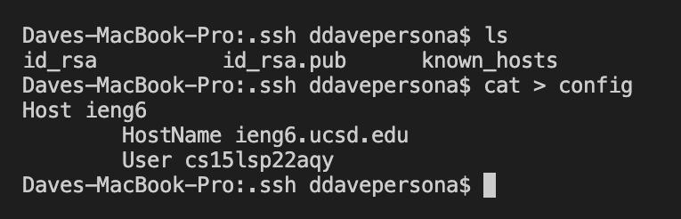
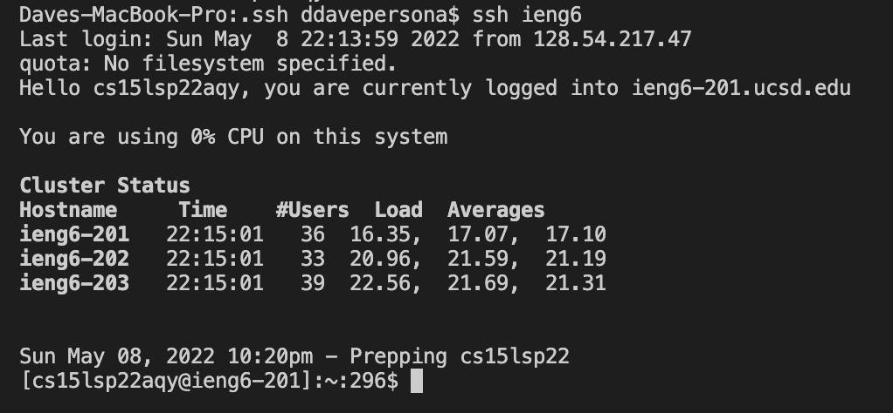
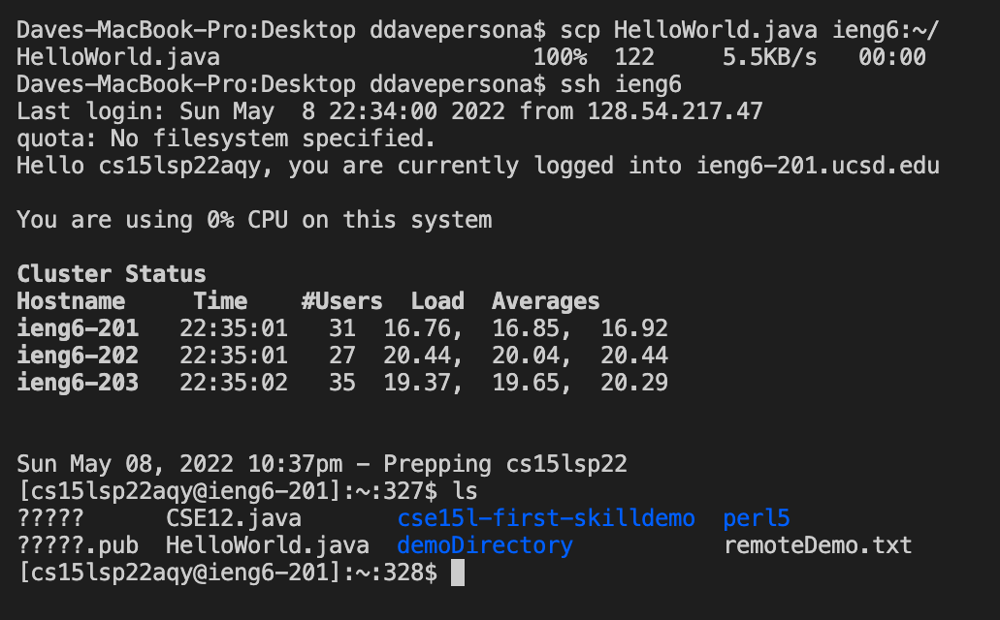
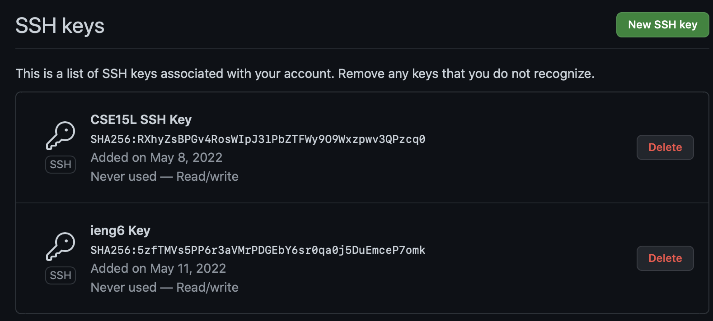
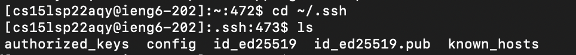
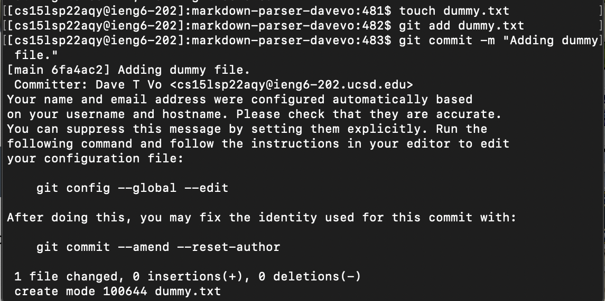
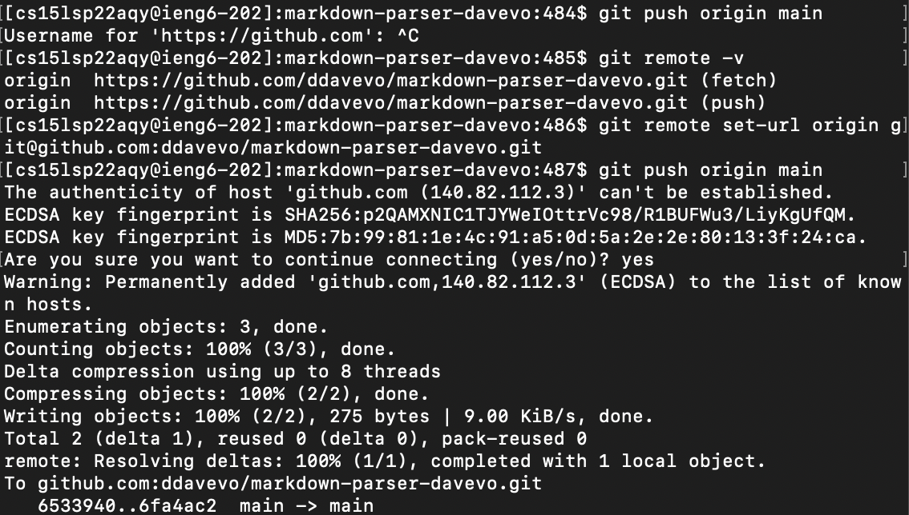
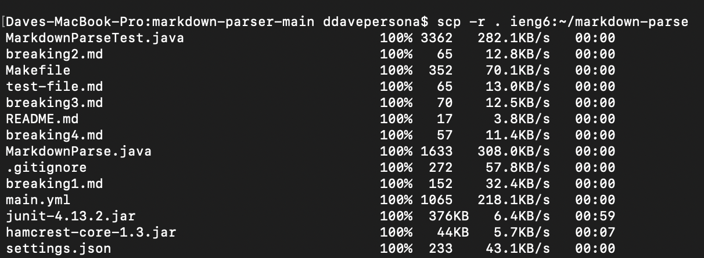
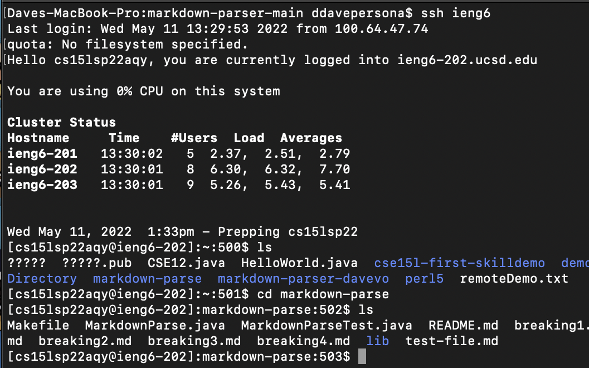
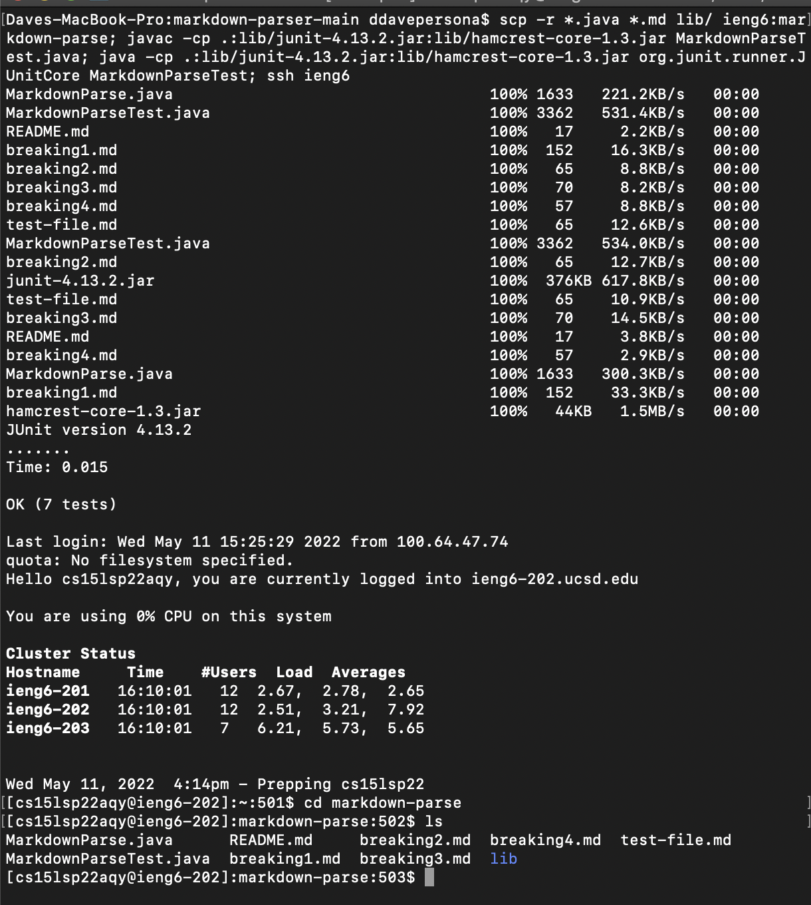

# **Lab 5: Group Choice Assignments**
`by Dave Vo | 4/11/22`

## 1. Streamlining `ssh` Configuration



Anytime I want to execute commands that include my server account `cs15lsp22###@ieng6.ucsd.edu`, I would normally have to type the entire account name in. Create an _alias_ instead makes this process less tedious. To do this, I create a `config` file on my computer's side with the following contents:

```
Host (aliasName)
    HostName (serverName)
    User (yourAccount)
```
NOTE: I chose **ieng6** as my aliasName, but it can be anything.
_________________



With that implemented, I can simply substitute my account name with the alias I created.



The alias can be used beyond logging in with the `$ ssh` command. For instance, I can use my alias for the `$ scp` command. 

________________

# 2. Setting Up GitHub Access from ieng6 Remote Server



When working with GitHub repositories in the remote server, SSH keys are required to push changes. 



After following GitHub's official guide on adding the public SSH key to my account, I would also end up having the private key in my server's `~/.ssh` directory. 



After setting up the SSH system, it is now possible to edit a repository's clone on the server and push those changes. 



When pushing changes to the main repository, it is crucial that the SSH link under the **Code** tab of the repository is used instead of HTTPS.

```
$ git remote -v
$ git remote set-url origin <SSH Link>
```

After running those commands, running `$ git push origin main` will successfully update the main GitHub repository.

The repository's commit history will reflect the [newly pushed change](https://github.com/ddavevo/markdown-parser-davevo/commit/6fa4ac227b282bd055bdadea87b6d230f1de54ed) from the ieng6 server.
_____________________

## 3. Copying Directories with `scp -r`



Running `$ scp -r . ieng6:~/markdown-parse` copies the current working directory into the remote server.

NOTE: The alias chosen is ieng6, but it can be anything. 
NOTE: The chosen directory name is markdown-parse, but it can be anything.



To confirm the directory has been copied, I logged into the remote server and checked the list of files in **markdown-parse**.

There are also ways to streamline `$ scp -r`. Since the previous command copies **every** file in the directory, it is possible to copy specific files such as exclusively .java files or .jar files in the lib/ folder.

Specifying the specific files looks like this (assuming there is an empty markdown-parse directory in the server):

`scp -r *.java *.md lib/ ieng6:markdown-parse`



To take the process one step further, I can chain multiple commands to both copy a directory and compile/run JUnit tests. I will break them down individually for clarity, but chaining can be done on only one line.

`scp -r *.java *.md lib/ ieng6:markdown-parse;`

`javac -cp .:lib/junit-4.13.2.jar:lib/hamcrest-core-1.3.jar MarkdownParseTest.java;`

`java -cp .:lib/junit-4.13.2.jar:lib/hamcrest-core-1.3.jar org.junit.runner.JUnitCore MarkdownParseTest;`

`ssh ieng6`