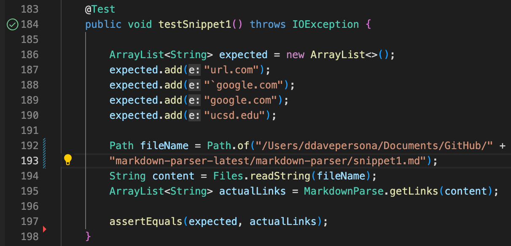

# **Lab 7: Inter-Group Repository Critiques**

`by Dave Vo | 5/20/22`

[My Repository](https://github.com/ddavevo/markdown-parser-davevo)

[Other Group's Repository](https://github.com/nquach1515/markdown-parser-cse15l)

## How the Markdown Links Gets Translated

## My Repository's Tests

## Other Repository's Tests

## My Repository's JUnit Test Results

## Other Repository's JUnit Test Results

